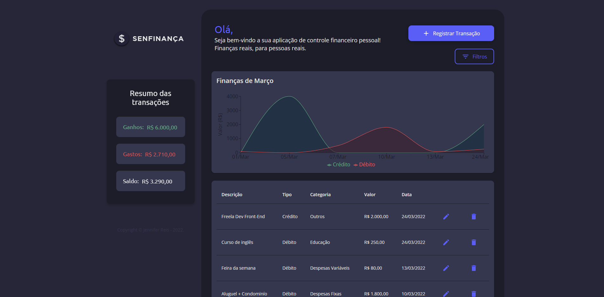
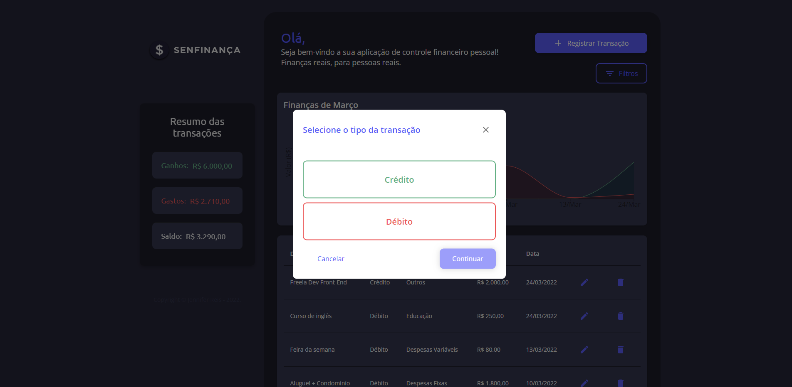
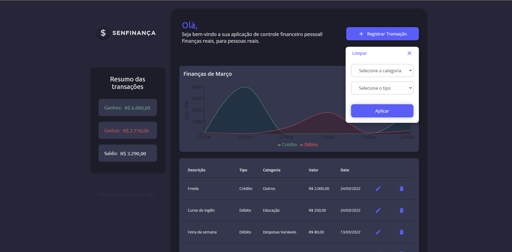

# SenFinança - Personal Finance App · [](https://www.npmjs.com/package/npm) [](http://makeapullrequest.com)

Aceitei o desafio e criei uma aplicação de controle de finanças pessoais. 
O SenFinança é uma aplicação que foi desenvolvida para que o usuário possa gerir suas transações. Ao acessar o app, é possível o usuário pode registre suas transações e acompanhe suas finanças. Sua transações podem ser de entrada (crédito) ou saída (débito) e ainda é possível realizar outras operações de maneira simples e intuitiva.

A aplicação é uma Single Page Application (SPA) e foi criada usando [React JS](https://pt-br.reactjs.org/), consumindo dados de um banco NoSQL, [Cloud Firestore](https://firebase.google.com/docs/firestore). Para completar a aplicação, vale ressaltar que além de React e Firebase, outras tecnologias foram utilizadas no projeto, sendo: [TypeScript](https://www.typescriptlang.org/), [Material UI](https://material-ui.com/), [Recharts](https://recharts.org/en-US/) e [Styled Components](https://styled-components.com/).

## [Preview](https://personalfinance-160ee.web.app/) - [WireFrame](https://www.figma.com/file/I7ZeKzr3V3bdDBVOH57HO8/App-SenFinan%C3%A7as?node-id=2%3A3)

A cada acesso a aplicação, é possível visualizar todos os dados de transações já registrados anteriomente, e caso sinta a necessidade é possível alterar suas transações através da edição ou ainda deletar se for necessário. 
Para uma visualização mais ampla, poderá visualizar suas transações mensais através do gráfico no topo do Dashboard, onde conseguirá verificar as totalizações de ganhos, de gastos e o saldo restante.

### **Dashboard**



### **Registro de transação**



### **Filtro em dropdown**



### Filtros implementados

Caso deseje encontrar sua transação de uma forma mais rápida, a aplicação permite que faça uma filtragem por meio de entrada de algum dos filtros abaixo:

- Tipo
- Categoria

## Requerimentos

- Node.js LTS release or greater
- Yarn (opcional)
- Npm
- Git

## Contruido com:

- React (17.0.2)
- Typescript (4.1.2)
- Context API (Gerenciamneto de estados)
- React Hooks

### Rodando o projeto localmente

Para começar a trabalhar você precisará executar alguns comandos, mas isso é somente na primeira vez. Para isso é importante que intale o [Git](https://git-scm.com/) e o [NodeJS LTS](https://nodejs.org/en/), depois é só seguir os seguintes passos:

1. Faça o fork do repositório

2. Clone para seu computador o fork feito

2. Na raiz do repositório, instale as dependências necessárias

   ```bash
   npm install

   # or

   yarn install
   ```

3. Rode o projeto 

   ```bash
   npm start

   # or

   yarn start
   ```

Prontinho! Quando você fizer todos esse procedimentos, o projeto irá executar e exibir no seu navegador a aplicação.


## Criando build de produção

```bash
   npm run build

   # or

   yarn run build
```

## Estrutura da Pasta

```bash
app-personal-finance
├───public
└───src
    ├───assets
    │   └───images
    ├───components
    │   ├───Button
    │   ├───Chart
    │   ├───ColoredCard
    │   ├───Copyright
    │   ├───Filters
    │   │   └───Dropdown
    │   ├───FinanceStatus
    │   ├───Form
    │   │   ├───Select
    │   │   └───TextField
    │   ├───Header
    │   ├───Modal
    │   │   ├───Deletion
    │   │   ├───Register
    │   │   └───Selection
    │   ├───Paper
    │   ├───SnackbarWapper
    │   └───Table
    ├───hooks
    ├───models
    │   ├───Filter
    │   └───Transaction
    ├───pages
    │   └───Dashboard
    ├───services
    │   └───utils
    └───theme
```
## Contribuições

Constribuições são sempre bem-vindas, para isso só criar um pull request e ficar a vontade para contribuir! 

## Autora

- [Jennifer Reis](https://github.com/JenniferReis)